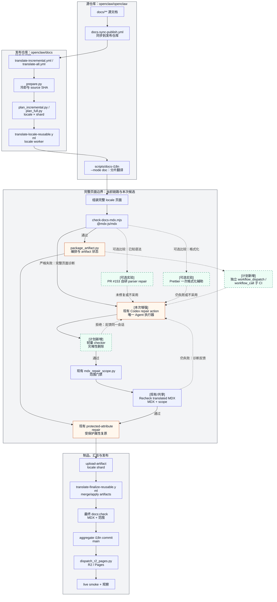
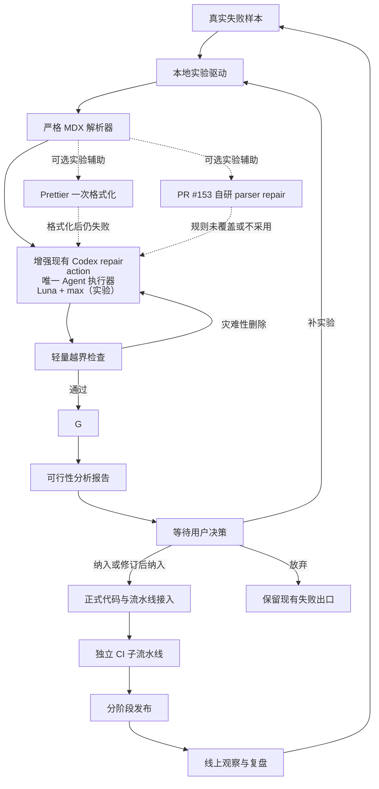

# Epic：翻译 MDX 修复兜底链

<!-- large-task-planning:vision -->
## 愿景

翻译产物出现 MDX 语法损坏时，流水线复用并增强现有 Codex repair action，作为唯一的 Agent 修复执行器；用户已确认这一方向。它接收完整页面诊断，经过轻量灾难性越界检查、有限反馈和严格 MDX 验证后再进入发布链。主路径不依赖 PR #153 或 Prettier；二者只在低成本、受保护的实验中验证是否有净收益，不默认引入需要长期维护的第二套修复器。单个问题不再轻易浪费已经完成的翻译；无法安全修复时仍留下可复盘证据。

<!-- large-task-planning:global-design -->
## 全局设计

方案分为若干能力流，细节随实验结果更新，不在规划阶段预设超时、重试或检查阈值。

下面的全景图展示现有翻译流水线、增强现有 Codex action 的接入位置，以及 PR #153/Prettier 两个可选实验辅助的位置。两张图均采用纵向布局，便于从上到下阅读阶段、依赖和反馈。实线表示现有或已确认方向，虚线表示计划增强或实验路径；`[可选实验]` 节点不表示当前生产链路已经具备该能力。

模块位置索引：现有 Codex action 的提示词是 `.openclaw-sync/docs-mdx-repair.md`，本次只增强它的触发、反馈、检查和日志边界；现有范围门禁是 `.github/scripts/i18n/mdx_repair_scope.py`。PR #153 的 `.github/scripts/i18n/repair_mdx_syntax.mjs`、`package_artifact.py` 和 `repair_mdx_protected_attributes.mjs` 只作为可选实验候选，Prettier 目前没有加入依赖；对应回归测试在 `.github/scripts/i18n/tests/test_i18n_scripts.py`，架构与决策记录在 `docs/.i18n/translation-workflow.md`。本计划新增的轻量 checker、增强循环和独立 CI 目前只固定在完整页面边界和调用顺序上，具体文件路径留到实验及用户决策后冻结。

所有修复路径共享同一个严格编译器验收。主路径只有增强后的现有 Codex repair action；它是唯一 Agent 执行器，本次增强只扩展完整页面触发、同会话反馈、轻量 checker 和日志，不再添加第二个 Codex action。PR #153 的自研 parser loop 与 Prettier 都是可跳过的单独实验辅助：前者只衡量既有代码是否值得维护，后者只验证格式化是否带来净收益；任一辅助都不能绕过 Codex、scope 或 parser oracle。独立 CI 子流水线先验证 fixture 和真实 Codex 环境，再接入正式翻译任务。完成实验后必须先形成可行性分析并等待用户明确决策；在决策之前不得进行正式流水线接入或发布。发布采用可回退的阶段化方式，线上长时间观察结果回写本 Epic。

现有基线显示，历史 full run `27629404260` 运行约 8 小时 48 分钟后产生 21 个 metadata-only 失败 artifact；线上 run `28273967200` 还暴露了翻译成功但 R2 内容未更新的问题。因此实验同时覆盖“修复是否保住翻译”和“发布是否真的生效”，不能只看单个 CI job 的绿色状态。

<!-- large-task-planning:manual-acceptance -->
## 人工验收

甲方验收代表可以看到：典型损坏页面在本地和 CI 中被修复并通过 MDX 检查；Codex 删除整篇或大段内容时会被拦截并收到可读反馈；小范围发布不影响其他已完成语言；线上页面在观察窗口内可访问，失败记录能定位到具体文件和修复轮次。详细案例见 `agent/黄金验收.json`。

<!-- large-task-planning:success-criteria -->
## 成功标准

| 门禁          | 通过条件                                                                                   |
| ------------- | ------------------------------------------------------------------------------------------ |
| READY         | 真实失败 fixture、稳定 oracle、代码入口和实验环境已固定，且用户边界已记录。                |
| COMPONENT     | fallback 模块、本地驱动、轻量检查器和独立 CI 子流水线分别通过对应行为测试并留有证据。      |
| USER_DECISION | 增强现有 action 的方向已确认；主实验完成、已运行的候选辅助有记录后，用户明确选择是否启用辅助、采用参数、修订或放弃；未决前不得进入正式接入。 |
| RELEASE       | 正式工作流接入前通过阶段化发布、回退和权限/范围检查，默认行为可恢复。                      |
| OBSERVE       | 线上真实运行完成观察窗口，日志、失败样本和复盘结论已归档。                                 |

<!-- large-task-planning:story-map -->
## Story 地图

| Story                                                                                   | 交付结果                                                                 |
| --------------------------------------------------------------------------------------- | ------------------------------------------------------------------------ |
| [STORY-01 建立真实故障基线](../stories/Story-01-建立真实故障基线.md)                     | 从真实流水线回放中形成可复现 fixture、oracle 和初始测量。                |
| [STORY-02 冻结兜底模块契约](../stories/Story-02-冻结兜底模块契约.md)                     | 根据实验确定增强现有 Codex action、反馈和轻量检查器的最小职责。         |
| [STORY-03 实现本地修复闭环](../stories/Story-03-实现本地修复闭环.md)                     | 在不接入生产的前提下，主比较无辅助与增强 action；按需单独探测 Prettier/PR#153。 |
| [STORY-03.1 汇总可行性并等待用户决策](../stories/Story-03.1-汇总可行性并等待用户决策.md) | 汇总实验与兼容性证据，暂停在正式接入前等待用户选择。                     |
| [STORY-04 接入翻译流水线](../stories/Story-04-接入翻译流水线.md)                         | 将增强后的现有 Codex action、日志和 artifact 结果接入正式链路。         |
| [STORY-05 建立独立 CI 验证子流水线](../stories/Story-05-建立独立CI验证子流水线.md)       | 可单独触发的 GitHub CI 验证环境，先证明模块再影响生产。                  |
| [STORY-06 阶段化发布上线](../stories/Story-06-阶段化发布上线.md)                         | 以 canary、开关和回退策略逐步启用，保留现有安全出口。                    |
| [STORY-07 黄金验收与线上复盘](../stories/Story-07-黄金验收与线上复盘.md)                 | 完成全量验收、线上观察和计划更新，形成可持续维护闭环。                   |

<!-- large-task-planning:project-boundaries -->
## 项目边界

- 只修改翻译控制面、修复模块、测试和工作流源文件；不手写 `docs/**` 生成页面。
- 不新增第二个 Codex repair action；复用并增强 `.openclaw-sync/docs-mdx-repair.md` 对应的现有工作流步骤，保留一个 Agent 执行入口。
- PR #153（当前 head `4d37f029f0`）、Prettier 和其他外部 formatter/parser 都只是可跳过的单独实验辅助，不等同于正式合并或依赖；PR 必须先 rebase/兼容性复核，formatter 必须固定版本并经过严格 parser/内容检查。当前默认倾向是不维护 PR153 规则、不加入 formatter 依赖，也不引入第二个 parser oracle，除非真实 fixture 证明有可量化净收益并经用户批准。
- 候选筛选已记录在 `docs/.i18n/translation-workflow.md`：`@takazudo/mdx-formatter` 仅作为可能的格式化对照，Tree-sitter + MDX grammar 仅作为未来诊断研究；markdownlint/remark-lint/eslint-mdx/mdformat/dprint 与 HTML parser 不视为本次结构修复候选。候选清单不自动扩展主实验矩阵。
- 当前并行 agent 的已交付范围是 PR #153 的 parser-guided syntax repair、打包接入、路径安全和合成回归测试；增强现有 Codex action、Prettier 试验和真实流水线 fixture 尚未实现，不能把 PR 现状当成完整方案。
- 初始模型组合记录为 `Codex + Luna + max`；具体模型标识、超时和重试由实验决定。
- Codex 修复允许处理翻译正文中的小差异；轻量检查器不追求语义完美，只拦截灾难性删除和截断。
- Prettier 若进入实验，只能在失败文件的临时副本上运行；格式化结果不通过严格 MDX 或安全检查时立即丢弃，不加入默认依赖。
- 所有 Codex 修改必须经过 MDX 编译和现有范围保护；未知问题允许明确失败并保留日志。
- 本地真实 Codex 测试需要显式环境和凭据，不作为普通离线测试的隐式依赖。
- CI 子流水线默认只读 fixture、上传证据，不直接提交生产翻译或触发线上发布；接入生产需经过 RELEASE 门禁。
- 硬门禁顺序是“完成实验 → 分析可行性 → 等待用户决策 → 正式实现”；可行性报告和用户明确决策都是正式代码接入的前置条件，决策未落盘时，后续 Story 保持 blocked。
- 日志不得默认泄露完整文档或密钥；原文体记录遵循现有隐私开关。

<!-- large-task-planning:authoritative-documents -->
## 权威文档

- [现有翻译工作流与 MDX 修复决策](../../../docs/.i18n/translation-workflow.md)
- [PR #153：解析器驱动的 MDX 语法修复候选](https://github.com/openclaw/docs/pull/153)
- [Prettier parser 选项](https://prettier.io/docs/options.html#parser)、[format API](https://prettier.io/docs/api/) 与 [3.9 发布说明](https://prettier.io/blog/2026/06/27/3.9.0.html)
- [Prettier MDX 初步探测证据](../agent/evidence/prettier-mdx-probe-2026-09-01.md)
- [其他 MDX formatter 候选探测证据](../agent/evidence/mdx-formatter-probe-2026-09-01.md)
- [并行 Agent 范围与进展复盘](../agent/evidence/parallel-agent-review-2026-09-01.md)
- [现有全量翻译故障交接](../../../I18N_FULL_TRANSLATION_HANDOFF_2026-06-17.md)
- [已有恢复计划与线上发现](../../../I18N_FULL_TRANSLATION_REPAIR_PLAN_2026-06-26.md)
- [翻译 locale 工作流](../../../.github/workflows/translate-locale-reusable.yml)
- [i18n 控制面脚本](../../../.github/scripts/i18n/)
